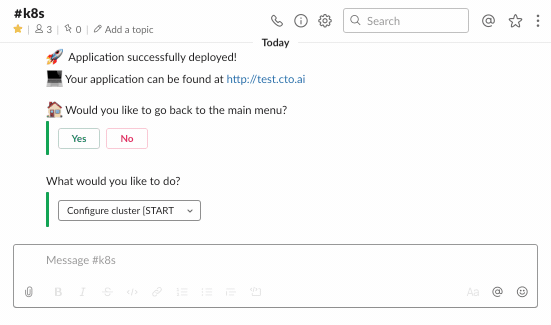
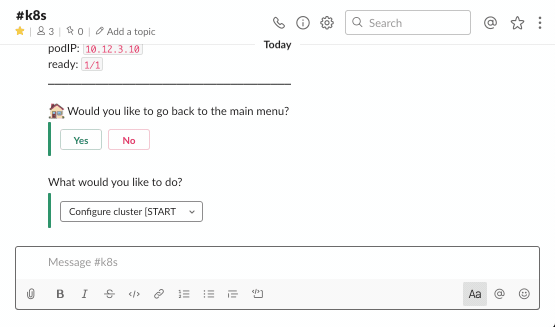
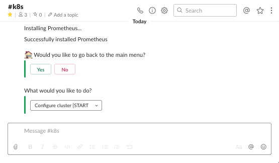
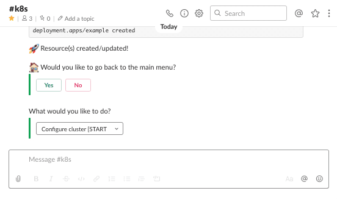
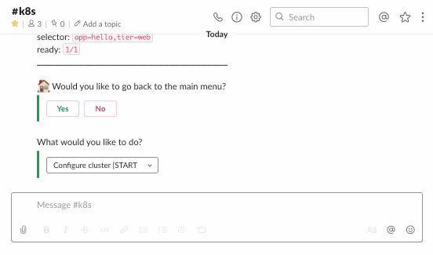

# Kubernetes (k8s) Op

An Op that facilitates the management of [Kubernetes](https://kubernetes.io/) clusters.

The Op currently supports **public** clusters managed with:
- [Google Kubernetes Engine](https://cloud.google.com/kubernetes-engine)
- [Amazon Elastic Kubernetes Service](https://aws.amazon.com/eks/)

This op has been built and tested only with EKS and GKE clusters; we cannot guarantee the op will work for any custom/vanilla Kubernetes cluster.

## Requirements

### Ops Platform

Running this op requires you to have access to the [Ops Platform](https://cto.ai/platform). Please review the [documentation](https://cto.ai/docs/overview) for detailed instructions on how to install the Ops CLI and/or Ops Slack application.

### Existing K8s Cluster & AWS/GCP Credentials

❗️ **Please consider running this op on a test cluster before running it on production clusters.**

* An existing **public** EKS or GKE Kubernetes cluster.
* AWS or GCP credentials set up as secrets in your Ops team.

Before running the op, please set the cloud specific credentials as secrets, following the instructions below. In order for the op to automatically retrieve these secrets, please reference the details below for the exact key names you should use when storing them. If the auto-match fails, the op users will be prompted to select an option from the available list of secrets every time they run the op.

#### AWS

`AWS_ACCOUNT_NUMBER`

Please refer to [this URL](https://docs.aws.amazon.com/general/latest/gr/acct-identifiers.html) for instructions on how to find your AWS Account Number. Once identified, run the following command to save it as a secret in your Ops team:

```sh
ops secrets:set -k AWS_ACCOUNT_NUMBER -v <VALUE>
```

* `AWS_ACCESS_KEY_ID` and `AWS_SECRET_ACCESS_KEY`

This op is built to support EKS clusters leveraging AWS IAM authenticator. To use this op, we recommend you create a dedicated machine user with programmatic access enabled. The user should be configured with the correct RBAC to list and create resources in the cluster. Ask a cluster admin to run `kubectl edit configmap -n kube-system aws-auth` and add the user's details under `mapUsers`. Additionally, the following predefined permissions policy might be required for all of the features in this op to function as expected:
* AmazonEKSClusterPolicy

Please refer to [this URL](https://docs.aws.amazon.com/general/latest/gr/aws-sec-cred-types.html#access-keys-and-secret-access-keys) for instructions and best practices on how to generate these access keys. Once ready, run the following commands to save them as secrets in your Ops team, replacing `<value>` with your value:

```sh
ops secrets:set -k AWS_ACCESS_KEY_ID -v <value>
ops secrets:set -k AWS_SECRET_ACCESS_KEY -v <value>
```

#### GCP

`GOOGLE_APPLICATION_CREDENTIALS`

The following predefined [roles](https://cloud.google.com/iam/docs/understanding-roles#predefined_roles) are required for all of the features in this op to function as expected:
* Compute Viewer
* Kubernetes Engine Admin
* Service Account User

Please refer to [this URL](https://cloud.google.com/iam/docs/creating-managing-service-accounts) for instructions on how to create a service account with the above mentioned permissions. Once created, you will need to create a private key for the respective service account and download it to your computer (JSON). When ready, run the following command to save the credentials as a secret in your Ops team, replacing `<key_file>` with the full path to your credentials JSON file:

```sh
ops secrets:set -k GOOGLE_APPLICATION_CREDENTIALS -v "$(cat <key_file> | tr -d '\n')"
```

## Usage

### CLI

```sh
ops run k8s
```

### Slack

```
/ops run k8s

```

## Features

### Configure cluster

Allows the user to save the cluster configuration (kubeconfig content) under a specific name in the Op team secrets.

### List resources (pods/deployments) under a specific namespace or all namespaces



### Install and uninstall K8s tools that will help manage and monitor your Kubernetes cluster

* [Kubernetes dashboard](https://kubernetes.io/docs/tasks/access-application-cluster/web-ui-dashboard) - AWS only
* [Metrics server](https://kubernetes.io/docs/tasks/debug-application-cluster/resource-metrics-pipeline/#metrics-server) - AWS only
* [NGINX ingress controller](https://github.com/kubernetes/ingress-nginx)
* [Prometheus](https://prometheus.io)
* [Grafana](https://grafana.com)





### Deploy applications to an existing cluster or update existing deployments



### Create a Kubernetes resource from YAML



## K8s Op Walkthrough - Watch video

[](https://youtu.be/ApgdS2hl-p4)

## Local Development

If you would like to interact with the cluster directly from your machine to debug/test things as you use the op or add additional features, you should consider the following:

* Install [kubectl](https://kubernetes.io/docs/tasks/tools/install-kubectl)
* Install [helm v3](https://helm.sh/docs/install)
* Set up an image registry for your application so you can push your applications Docker images to it
* Make sure the relevant kubeconfig files are present on your machine & that you configure your environment to use the
  * Run `export KUBECONFIG=$KUBECONFIG:~/.kube/<kubeconfig_file>`
  * Run `kubectl config use-context <kubeconfig_file>`
* Make sure you have the correct AWS profile (as per your kubeconfig) set up in `~/.aws/credentials`:

```sh
[k8s-creds]
aws_access_key_id = xxxxxx
aws_secret_access_key = xxxxxx
```

### Cloud Providers

* AWS integration - `src/utils/aws.ts`
* GCP integration - `src/utils/gcp.ts`

* To add a new provider:
  * Create a new class to represent the provider
  * Add it to `src/utils/cloud-provider-factory.ts`
    * Methods that are universal across all providers are listed in this file--please follow the function signature defined in this file for all providers as much as possible
  * Try keep object initialization the same between providers
    * e.g. both AWS and GCP objects are created using `new AWS()` and `new GCP()`

### Manager/Deployer

* **Listing resources**
  * Main logic - `src/utils/manager.ts`
  * Pod and deployment info retrieval logic - `src/utils/cluster-resources.ts`
* **Installing/Uninstalling resources**
  * Main logic - `src/utils/manager.ts` and `src/utils/cluster-resources.ts`
* **Deploying application**
  * Main logic - `src/utils/deploy.ts`
  * K8s configs for deployments - `src/utils/configs.ts`
* **Logic shared by both parts of the application**
  * Welcome message - `src/utils/welcome-message.ts`
  * Confirmation message - `src/utils/confirm-message.ts`
  * Kubeconfig set up - `src/utils/kubeconfig.ts`
  * Logging - `src/utils/track.ts`
  * Various helper functions - `src/utils/helpers.ts`

## Contributing

See the [Contributing Docs](CONTRIBUTING.md) for more information.

## Contributors

<table>
  <tr>
    <td align="center"><a href="https://github.com/choww"><br /><sub><b>Carmen Chow</b></sub></a><br/></td>
    <td align="center"><a href="https://github.com/ruxandrafed"><br /><sub><b>Ruxandra Fediuc</b></sub></a><br/></td>
    <td align="center"><a href="https://github.com/aschereT"><br /><sub><b>Vincent Tan</b></sub></a><br/></td>
  </tr>
</table>

## License

[MIT](LICENSE)